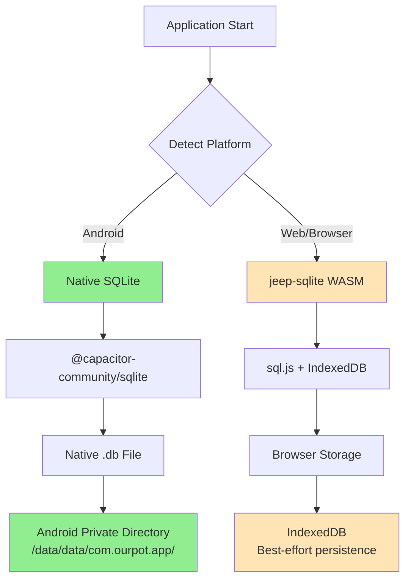
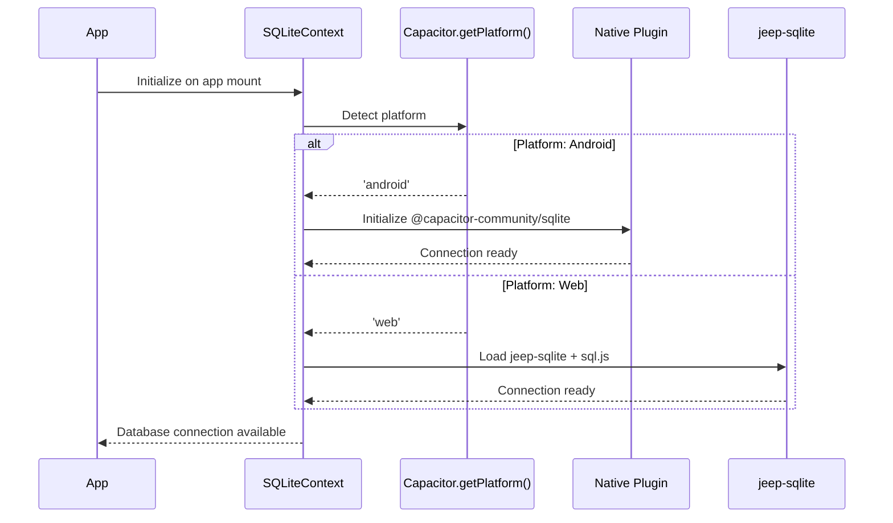
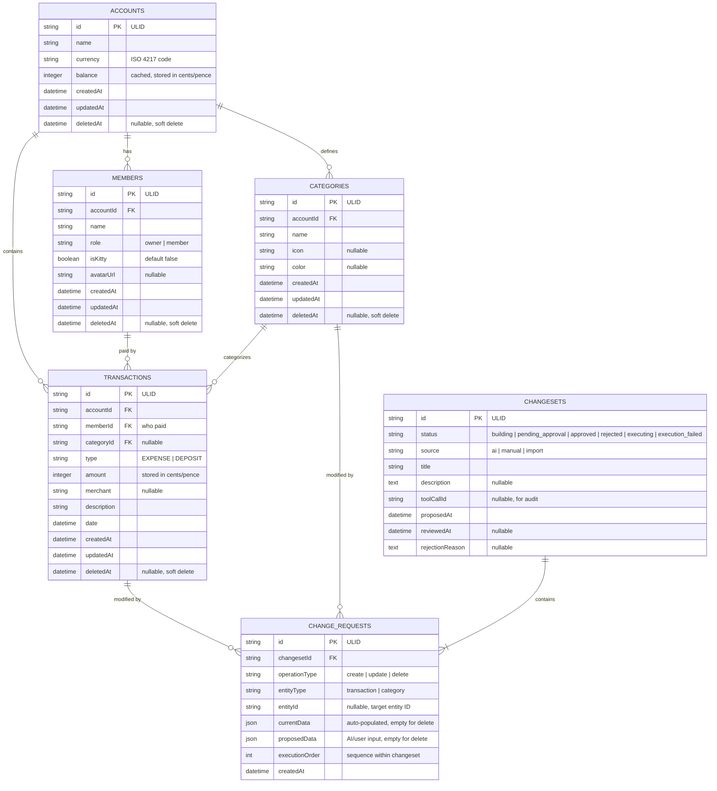
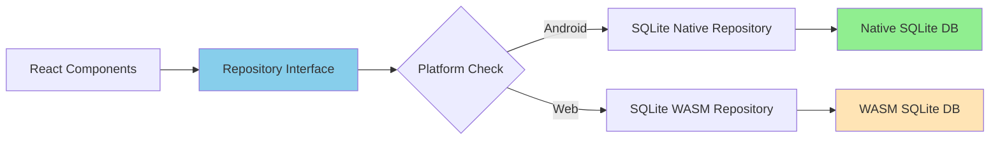
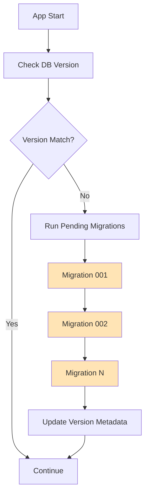
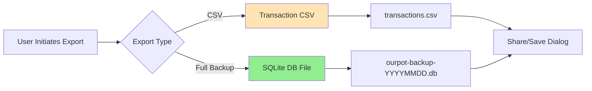

# SAD Section 3: Data Layer & Persistence Strategy

**Project:** OurPot - Household Kitty Expense Tracker
**Version:** v1.0 (Local-Only)
**Date:** 2025-12-18
**Status:** Living Document

---

## 3.1 Storage Engine (SQLite Native vs. WASM Fallback)

### Engine Selection by Platform



### Storage Characteristics

| Characteristic | Native SQLite (Android) | WASM SQLite (Browser) |
|----------------|-------------------------|----------------------|
| **Durability** | Guaranteed until uninstall | Best-effort (evictable) |
| **Performance** | Native speed | ~70-80% of native |
| **ACID** | Full support | Full support |
| **File Location** | Private app directory | IndexedDB |
| **Encryption** | Possible (future) | Not supported |
| **Use Case** | Production | Development only |

**Decision Rationale:** See [TDD-1: PWA Strategy](./20251217-TDD-1-PWA%20strategy.md) Section D1 for full analysis.

---

## 3.2 Platform Detection & Initialization

### Initialization Pattern



### Initialization Contract

**SQLite Context Provider Responsibilities:**
1. Detect runtime platform (Capacitor.getPlatform())
2. Load appropriate SQLite implementation
3. Initialize database connection
4. Run pending migrations
5. Provide connection to React components via Context

**Component Contract:**
- Components consume SQLiteContext via `useContext(SQLiteContext)`
- Components do NOT know which implementation is active
- All database operations go through Data Access Layer (DAL)

---

## 3.3 Database Schema Design (ER Diagram)

### Entity-Relationship Model



### Table Definitions

#### Accounts Table

**Purpose:** Financial container representing a shared kitty (e.g., "House Expenses", "Holiday Fund").

| Column | Type | Constraints | Notes |
|--------|------|-------------|-------|
| id | TEXT | PRIMARY KEY | ULID |
| name | TEXT | NOT NULL | Display name (e.g., "House Expenses") |
| currency | TEXT | NOT NULL | ISO 4217 code (GBP, EUR, USD) |
| balance | INTEGER | NOT NULL, DEFAULT 0 | Cached balance in cents/pence (e.g., 4250 = £42.50) |
| createdAt | DATETIME | NOT NULL | Record creation timestamp |
| updatedAt | DATETIME | NOT NULL | Last modification timestamp |
| deletedAt | DATETIME | NULL | Soft delete timestamp |

**Indexes:**
- `idx_accounts_deletedAt` on (deletedAt) for filtering active accounts

**Balance Management:**
- Automatically updated via database triggers on transaction insert/update/delete
- Reconciliation function recalculates from transactions on app startup

#### Members Table

**Purpose:** Participants within an account who can pay for or contribute to transactions.

| Column | Type | Constraints | Notes |
|--------|------|-------------|-------|
| id | TEXT | PRIMARY KEY | ULID |
| accountId | TEXT | FOREIGN KEY | References accounts.id |
| name | TEXT | NOT NULL | Display name |
| role | TEXT | NOT NULL | Enum: owner, member |
| isKitty | BOOLEAN | NOT NULL, DEFAULT FALSE | True if this member represents the kitty itself |
| avatarUrl | TEXT | NULL | Optional profile image URL |
| createdAt | DATETIME | NOT NULL | Record creation timestamp |
| updatedAt | DATETIME | NOT NULL | Last modification timestamp |
| deletedAt | DATETIME | NULL | Soft delete timestamp |

**Indexes:**
- `idx_members_accountId` on (accountId)
- `idx_members_isKitty` on (accountId, isKitty) for finding the kitty member
- `idx_members_deletedAt` on (deletedAt)

**Constraints:**
- `unique_kitty_per_account` UNIQUE (accountId) WHERE (isKitty = TRUE AND deletedAt IS NULL) - enforces one kitty member per account

**Role Semantics:**
- **owner**: Can manage account settings, invite/remove members, delete account
- **member**: Can add transactions, view reports, manage own transactions

**isKitty Semantics:**
- **false** (default): Regular human member who pays for or contributes to transactions
- **true**: Special member representing the kitty/account itself, used when the kitty pays for something (e.g., "Kitty paid Bob £50 reimbursement")

#### Transactions Table

**Purpose:** Core financial ledger entries tracking expenses and deposits.

| Column | Type | Constraints | Notes |
|--------|------|-------------|-------|
| id | TEXT | PRIMARY KEY | ULID for future sync compatibility |
| accountId | TEXT | FOREIGN KEY | References accounts.id |
| memberId | TEXT | FOREIGN KEY | References members.id (who paid) |
| categoryId | TEXT | FOREIGN KEY, NULL | References categories.id (nullable for deposits) |
| type | TEXT | NOT NULL | Enum: EXPENSE, DEPOSIT |
| amount | INTEGER | NOT NULL | Amount in cents/pence (e.g., 4200 = £42.00) |
| merchant | TEXT | NULL | Merchant/vendor name (e.g., "Whole Foods", "Shell Gas") |
| description | TEXT | NOT NULL | User-entered description/notes |
| date | DATETIME | NOT NULL | Transaction date (user-specified) |
| createdAt | DATETIME | NOT NULL | Record creation timestamp |
| updatedAt | DATETIME | NOT NULL | Last modification timestamp |
| deletedAt | DATETIME | NULL | Soft delete timestamp |

**Indexes:**
- `idx_transactions_accountId` on (accountId)
- `idx_transactions_memberId` on (memberId)
- `idx_transactions_categoryId` on (categoryId)
- `idx_transactions_date` on (date DESC)
- `idx_transactions_type` on (type)
- `idx_transactions_merchant` on (merchant) for filtering by vendor
- `idx_transactions_deletedAt` on (deletedAt) for filtering soft-deleted records

**Type Semantics:**
- **EXPENSE**: Money out (reduces account balance)
- **DEPOSIT**: Money in (increases account balance)

#### Categories Table

**Purpose:** Transaction categorization scoped per account (e.g., Groceries, Rent, Entertainment).

| Column | Type | Constraints | Notes |
|--------|------|-------------|-------|
| id | TEXT | PRIMARY KEY | ULID |
| accountId | TEXT | FOREIGN KEY | References accounts.id |
| name | TEXT | NOT NULL | Category name (unique per account) |
| icon | TEXT | NULL | Icon identifier (emoji or icon name) |
| color | TEXT | NULL | Hex color code for UI |
| createdAt | DATETIME | NOT NULL | Record creation timestamp |
| updatedAt | DATETIME | NOT NULL | Last modification timestamp |
| deletedAt | DATETIME | NULL | Soft delete timestamp |

**Indexes:**
- `idx_categories_accountId` on (accountId)
- `idx_categories_name` on (accountId, name) for fast lookup
- `idx_categories_deletedAt` on (deletedAt)

**Scoping Rationale:**
- Categories are account-specific (household needs "Rent", holiday fund needs "Transport")
- Different accounts can have categories with same name but different IDs

#### ChangeSets Table

**Purpose:** AI-generated or manual proposals for ledger modifications.

| Column | Type | Constraints | Notes |
|--------|------|-------------|-------|
| id | TEXT | PRIMARY KEY | ULID |
| status | TEXT | NOT NULL | Enum: building, pending_approval, approved, rejected, executing, execution_failed |
| source | TEXT | NOT NULL | Enum: ai, manual, import |
| title | TEXT | NOT NULL | Short summary of changeset (e.g., "Add groceries expense") |
| description | TEXT | NULL | Detailed explanation or context |
| toolCallId | TEXT | NULL | AI tool call ID for audit/debugging |
| proposedAt | DATETIME | NOT NULL | When changeset was created |
| reviewedAt | DATETIME | NULL | When user made approval/rejection decision (NULL if still pending) |
| rejectionReason | TEXT | NULL | User-provided reason (only populated for status='rejected', NULL for iterative refinement back to building) |

**Indexes:**
- `idx_changesets_status` on (status)
- `idx_changesets_proposedAt` on (proposedAt DESC)
- `idx_changesets_toolCallId` on (toolCallId) for AI audit trail

**Status Flow:**
- **building**: AI is accumulating/correcting change requests in keyed buffer (persisted as work-in-progress)
- **pending_approval**: Ready for user review (AI stream paused)
- **executing**: Operations being applied within database transaction (ephemeral, transitions quickly)
- **approved**: User accepted and operations successfully applied (final persisted state)
- **rejected**: User completely rejected changeset (persisted for audit trail only, not actionable)
- **execution_failed**: Execution encountered error and rolled back (ephemeral, AI auto-corrects)

**Note on Rejection Modes:**
- **Iterative Correction (Reject with Feedback)**: State returns from `pending_approval` to `building`, changeset remains in work-in-progress state
- **Complete Rejection**: Status set to `rejected` and persisted permanently for audit trail; neither user nor AI will work on this changeset again

#### Change_Requests Table

**Purpose:** Individual change requests within a changeset (atomic changes).

| Column | Type | Constraints | Notes |
|--------|------|-------------|-------|
| id | TEXT | PRIMARY KEY | ULID |
| changesetId | TEXT | FOREIGN KEY | References changesets.id |
| operationType | TEXT | NOT NULL | Enum: create, update, delete |
| entityType | TEXT | NOT NULL | Enum: transaction, category, account, member |
| entityId | TEXT | NULL | Target entity ID (NULL for creates) |
| currentData | TEXT | NULL | JSON of current entity state (auto-populated) |
| proposedData | TEXT | NULL | JSON of proposed changes (AI/user input) |
| executionOrder | INTEGER | NOT NULL | Sequence number (0, 1, 2...) |
| createdAt | DATETIME | NOT NULL | When request was created |

**Indexes:**
- `idx_change_requests_changesetId` on (changesetId)
- `idx_change_requests_executionOrder` on (changesetId, executionOrder)
- `idx_change_requests_entityId` on (entityId) for tracking changes to specific entities

**Data Field Semantics:**

- **currentData**: Automatically populated from database when operation targets existing entity; empty for `create` and `delete`
- **proposedData**: AI-generated or user-input changes; empty for `delete`

**Examples:**

*Create Transaction Request:*
```json
{
  "currentData": null,
  "proposedData": {
    "accountId": "01JBQR...",
    "memberId": "01JBQS...",
    "categoryId": "01JBQT...",
    "type": "EXPENSE",
    "amount": 4200,
    "merchant": "Whole Foods",
    "description": "Weekly groceries",
    "date": "2025-12-18T10:30:00Z"
  }
}
```
*Note: amount is 4200 (cents) = £42.00*

*Update Transaction Request:*
```json
{
  "currentData": {
    "amount": 4200,
    "merchant": "Whole Foods",
    "description": "Weekly groceries"
  },
  "proposedData": {
    "amount": 4500,
    "merchant": "Whole Foods Market",
    "description": "Weekly groceries (updated)"
  }
}
```
*Note: amounts are in cents (4200 = £42.00, 4500 = £45.00)*

*Delete Transaction Request:*
```json
{
  "currentData": {
    "accountId": "01JBQR...",
    "amount": 4200,
    "merchant": "Whole Foods",
    "description": "Weekly groceries",
    "date": "2025-12-18T10:30:00Z"
  },
  "proposedData": null
}
```
*Note: amount is 4200 (cents) = £42.00*

### Balance Management Strategy

**Purpose:** Maintain accurate account balances without scanning all transactions on every read.

#### Cached Balance Field

The `accounts.balance` field stores the current balance with 2 decimal places:
- **EXPENSE** transactions reduce the balance
- **DEPOSIT** transactions increase the balance
- Soft-deleted transactions reverse their effect on balance

#### Automatic Updates via Database Triggers

**Trigger on Transaction Insert:**
```sql
CREATE TRIGGER update_balance_on_insert
AFTER INSERT ON transactions
FOR EACH ROW
WHEN NEW.deletedAt IS NULL
BEGIN
  UPDATE accounts
  SET balance = balance + (
    CASE NEW.type
      WHEN 'DEPOSIT' THEN NEW.amount
      WHEN 'EXPENSE' THEN -NEW.amount
    END
  )
  WHERE id = NEW.accountId;
END;
```

**Trigger on Transaction Update:**
```sql
CREATE TRIGGER update_balance_on_update
AFTER UPDATE ON transactions
FOR EACH ROW
BEGIN
  -- Reverse old amount if it was active
  UPDATE accounts
  SET balance = balance - (
    CASE OLD.type
      WHEN 'DEPOSIT' THEN OLD.amount
      WHEN 'EXPENSE' THEN -OLD.amount
    END
  )
  WHERE id = OLD.accountId AND OLD.deletedAt IS NULL;

  -- Apply new amount if it's active
  UPDATE accounts
  SET balance = balance + (
    CASE NEW.type
      WHEN 'DEPOSIT' THEN NEW.amount
      WHEN 'EXPENSE' THEN -NEW.amount
    END
  )
  WHERE id = NEW.accountId AND NEW.deletedAt IS NULL;
END;
```

**Trigger on Transaction Delete:**
- Reverses transaction amount from balance

#### Reconciliation Function

**Purpose:** Ensure eventual consistency by recalculating balance from transaction history.

**Execution Triggers:**
- App startup (verify integrity)
- After data restore from backup
- Manual user-initiated reconciliation (Settings > Advanced)

**Algorithm:**
```
FOR each account:
  calculated_balance = SUM(
    CASE type
      WHEN 'DEPOSIT' THEN amount
      WHEN 'EXPENSE' THEN -amount
    END
  ) WHERE deletedAt IS NULL

  UPDATE accounts SET balance = calculated_balance WHERE id = account.id
```

**Trade-offs:**
- **Pro**: Fast balance reads (O(1) query)
- **Pro**: Self-healing via reconciliation
- **Con**: Slightly more complex write logic
- **Con**: Potential temporary inconsistency (triggers fail)

### Design Decisions

**Why ACCOUNTS as parent entity?**
- Enables multiple separate kitties per user (household bills vs. holiday fund)
- Supports multi-currency scenarios (GBP household, EUR holiday)
- Provides scoping boundary for categories and members
- Prepares for future multi-user sync (accounts as sync units)

**Why MEMBERS scoped to accounts (not global users)?**
- Simplifies v1: no authentication, no global user identity
- Different accounts have different participants
- Aligns with "household sharing" model (members are context-specific)
- Future evolution: link members to global users when auth is added

**Why isKitty boolean in members?**
- Enables modeling the kitty itself as a "payer" (e.g., reimbursements, withdrawals)
- Simplifies transaction modeling: all transactions have a memberId (no special cases)
- Example use case: "Alice paid £20 for groceries, Kitty reimbursed Alice £20"
- UI can filter to show only human members vs. show all including kitty
- One kitty member per account (enforced via unique index on accountId where isKitty=true)

**Why INTEGER for amount? (Cents/Pence Storage)**
- **Design Decision:** Store amounts as INTEGER in smallest currency unit (cents/pence)
  - 42.50 GBP → stored as `4250` (pence)
  - 1200.00 EUR → stored as `120000` (cents)
  - 0.99 USD → stored as `99` (cents)

**Benefits:**
- ✅ **Exact precision:** No floating-point rounding errors
- ✅ **Safe arithmetic:** Addition/subtraction in SQL guaranteed correct
- ✅ **Standard practice:** Industry standard for financial applications
- ✅ **SQLite native:** INTEGER is SQLite's native type (no affinity conversion)
- ✅ **Wide range:** Supports up to 9,223,372,036,854,775,807 cents (~92 quadrillion dollars)

**Implementation Details:**
- **Storage:** `amount INTEGER NOT NULL`
- **Display conversion:** `display_amount = amount / 100` (e.g., 4250 → £42.50)
- **Input conversion:** `stored_amount = user_input * 100` (e.g., £42.50 → 4250)
- **Database queries:** All arithmetic done in cents (no decimal conversion needed)

**Examples:**
- User enters: £42.50 → Stored: 4250
- Database stores: 4250 → Display: £42.50
- Balance calculation: 10000 - 4250 = 5750 (£100.00 - £42.50 = £57.50)

**Currency Precision:**
- Works for all major currencies with 2 decimal places (GBP, EUR, USD, etc.)
- For zero-decimal currencies (JPY, KRW), store directly without conversion
- Application layer handles currency-specific formatting

**Why EXPENSE vs DEPOSIT types?**
- Clarifies transaction semantics (money in vs. money out)
- Simplifies balance calculation logic
- Enables filtering by type (show only expenses, show only deposits)

**Why separate merchant field (not merged with description)?**
- Enables filtering/grouping by vendor (e.g., "show all Whole Foods purchases")
- AI can extract merchant from prompts ("I bought milk at Tesco")
- Supports future merchant auto-categorization
- Description remains free-form for notes/details

**Why categories scoped to accounts?**
- Different kitties need different categories (rent vs. transport)
- Avoids category namespace collision across accounts
- Aligns with "account as boundary" principle

**Why ULIDs instead of auto-increment IDs?**
- Enables future multi-device sync (globally unique IDs)
- Sortable by creation time (timestamp prefix)
- No ID collision risk when merging data

**Why soft deletes (deletedAt)?**
- Preserves audit trail
- Enables future "undo" functionality
- Simplifies conflict resolution in future sync

**Why separate Change_Requests table (not inline in changeset)?**
- Changesets can contain multiple operations (batch proposals)
- Operations are ordered (executionOrder) for deterministic replay
- Rejected changesets remain queryable (not deleted)

**Why currentData + proposedData (not single payload)?**
- Audit trail: shows what was changed (before/after)
- AI debugging: see what AI proposed vs. current state
- User transparency: review widget shows diff, not just new values

---

## 3.4 Data Access Layer (Repository Pattern)

### Architecture Pattern



### Repository Responsibilities

**AccountRepository:**
- `getAll()`: Fetch all active accounts
- `getById(id)`: Fetch single account with balance
- `create(account)`: Insert new account
- `update(id, changes)`: Update account details
- `softDelete(id)`: Mark account as deleted
- `reconcileBalance(id)`: Recalculate balance from transactions

**MemberRepository:**
- `getAllByAccount(accountId)`: Fetch all members for an account
- `getHumanMembersByAccount(accountId)`: Fetch only human members (isKitty=false)
- `getKittyMember(accountId)`: Fetch the special kitty member (isKitty=true)
- `getById(id)`: Fetch single member
- `create(member)`: Insert new member
- `update(id, changes)`: Update member details
- `softDelete(id)`: Mark member as deleted

**TransactionRepository:**
- `getAllByAccount(accountId, filters?)`: Fetch transactions with optional filters
- `getById(id)`: Fetch single transaction
- `create(transaction)`: Insert new transaction (triggers balance update)
- `update(id, changes)`: Update existing transaction
- `softDelete(id)`: Mark transaction as deleted (reverses balance effect)
- `search(accountId, query)`: Full-text search on merchant and description

**CategoryRepository:**
- `getAllByAccount(accountId)`: Fetch all active categories for an account
- `getById(id)`: Fetch single category
- `create(category)`: Insert new category
- `update(id, changes)`: Update category
- `softDelete(id)`: Mark category as deleted

**ChangeSetRepository:**
- `create(changeset, changeRequests[])`: Insert changeset with change requests (atomic transaction)
- `getById(id)`: Fetch changeset with change requests
- `updateStatus(id, status, reviewedAt)`: Mark as approved or return to building
- `getByStatus(status)`: Fetch changesets by status (e.g., "pending_approval", "approved")
- `getApprovedByAccount(accountId, limit?)`: Fetch approved changesets for audit trail
- `applyChangeSet(id)`: Execute change requests and update status to "approved"

### Key Patterns

**Transaction Boundaries:**
- ChangeSet creation and operation application must be atomic
- Use SQLite transactions (`BEGIN`, `COMMIT`, `ROLLBACK`)

**Error Handling:**
- Repository methods throw on database errors
- Components handle errors at UI boundary (toast notifications)

**Abstraction:**
- Repositories hide platform-specific SQLite API differences
- Components never call SQLite directly

---

## 3.5 Migrations & Versioning Strategy

### Migration Architecture



### Version Metadata Table

**Schema Migrations Table:**
```sql
CREATE TABLE schema_migrations (
  version INTEGER PRIMARY KEY,
  applied_at DATETIME NOT NULL,
  description TEXT NOT NULL
);
```

**Initial Version (v1):**
- Version 1: Create accounts, members, transactions, categories, changesets, change_requests tables
- Includes balance management triggers on transactions table

### Migration Principles

**Forward-Only:**
- Migrations are never reversed (no "down" migrations)
- Schema changes are additive when possible
- Breaking changes handled via new columns with defaults

**Idempotent:**
- Migrations check existence before creating (IF NOT EXISTS)
- Re-running same migration is safe

**Tested:**
- Each migration has automated test
- Test data survives migration (no data loss)

**Versioned:**
- Migrations numbered sequentially (001, 002, 003...)
- Version stored in `schema_migrations` table

**Example Migration Flow:**

```
v1 → v2: Add "tags" column to transactions (nullable, default NULL)
v2 → v3: Create "budgets" table (future feature)
v3 → v4: Add index on transactions.description for full-text search
```

---

## 3.6 Backup & Export (Manual CSV + Full-Fidelity Path)

### Backup Strategy



### Export Formats

#### CSV Export (Phase 1 Minimum)

**Purpose:** Human-readable, spreadsheet-compatible export.

**Scope:** Transactions with account and member context (no changesets, no rejected proposals).

**Format:**
```csv
Date,Type,Amount,Merchant,Category,Member,Description,Account
2025-12-18,EXPENSE,42.00,Whole Foods,Groceries,Alice,"Weekly groceries",House Expenses
2025-12-17,EXPENSE,1200.00,Landlord LLC,Rent,Bob,"December rent",House Expenses
2025-12-16,DEPOSIT,500.00,,,Alice,"Monthly contribution",House Expenses
```

**Note:** CSV export converts amounts to decimal format for human readability (4200 cents → 42.00). Import must convert back to cents (42.00 → 4200).

**Limitations:**
- Does not preserve ULIDs (regenerated on import)
- Does not preserve changesets or rejected proposals
- Manual import requires re-categorization if categories missing

#### Full-Fidelity Backup (Phase 1 Recommended)

**Purpose:** Complete database backup for restore/migration.

**Scope:** Entire SQLite database file (all tables, all data).

**Format:** Binary `.db` file (SQLite database file).

**Restore Process:**
1. User installs app on new device
2. User imports `.db` file
3. App detects existing backup, offers to replace current database
4. App runs migrations if backup version < current version

**Encryption (Future):**
- v1: Unencrypted backup (user owns plaintext file)
- v2: Optional password-encrypted backup using SQLCipher

### Backup Triggers

**Manual Only (v1):**
- User navigates to Settings → Backup & Export
- User taps "Export CSV" or "Create Full Backup"
- File saved to device storage (Android: Downloads folder)
- User can share via Android share sheet (email, cloud storage, etc.)

**Future (v2):**
- Optional automatic backup schedule (daily/weekly)
- Optional cloud backup (encrypted, user-controlled)

---

## Data Layer Summary

**Key Architectural Decisions:**

1. **Account-Centric Model:** Accounts as parent entity enabling multiple kitties and future multi-user sync
2. **Member Attribution:** Track who paid for each transaction, scoped per account
3. **Cached Balance:** O(1) balance reads via triggers, reconciliation for consistency
4. **DECIMAL Amount:** Stores with 2 decimal places for human readability
5. **Scoped Categories:** Per-account categorization prevents namespace collision
6. **Platform Abstraction:** Repository pattern hides SQLite implementation differences
7. **Future-Proof IDs:** ULIDs enable future sync without schema migration
8. **Soft Deletes:** Preserve audit trail and enable conflict resolution
9. **Change Request Model:** currentData + proposedData for audit trail and AI debugging
10. **Keyed Buffer:** Last-write-wins upsert for changeset building (eliminates index management)
11. **Approved-Only Persistence:** Only final approved changesets persisted (ephemeral corrections)
12. **Migration Strategy:** Forward-only, versioned, idempotent
13. **Backup Safety Net:** Full-fidelity backup ensures user data sovereignty

**Trade-offs Accepted:**

- **Complexity:** Separate change_requests table adds joins, but enables audit trail and diff visualization
- **Storage:** Soft deletes increase storage usage, but preserve history
- **Performance:** ULIDs are longer than integers, but negligible impact for expected data volume (<10K transactions)
- **Balance Triggers:** More complex write logic, but dramatically faster balance reads
- **No Rejection History:** Intermediate correction attempts not persisted (only approved changesets stored)
- **Keyed Buffer Complexity:** Requires transformation layer to manage upsert logic, but eliminates AI index tracking errors
