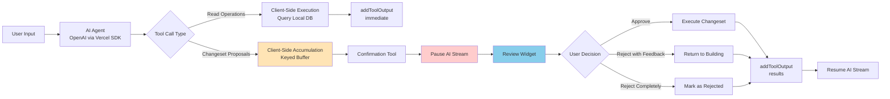

# SAD Section 5: AI & Agent Integration

**Project:** OurPot - Household Kitty Expense Tracker
**Version:** v1.0 (Local-Only)
**Date:** 2025-12-18
**Status:** Living Document

---

## 5.1 Vercel AI SDK Implementation (Client-Side Usage)

### Architecture Overview



### SDK Configuration

**Core Setup:**
- **AI Provider:** OpenAI (gpt-4 or equivalent)
- **SDK:** Vercel AI SDK (client-side streaming)
- **Execution Mode:** All tools execute client-side only (no server-side execution in v1)
- **Streaming:** Enabled for natural conversation flow

**Client-Side Tool Pattern:**
```typescript
const tools = {
  // Read operations - immediate execution
  getCategories: {
    description: "Fetch all categories for the current account",
    parameters: z.object({ /* ... */ }),
    execute: async (params) => {
      // Direct database query
      return await categoryRepository.getAll(currentAccountId);
    }
  },

  // Changeset proposals - no execute, accumulates
  createTransactionChangeRequest: {
    description: "Propose creating a new transaction (will require approval)",
    parameters: z.object({ /* ... */ }),
    // NO execute function - client intercepts and buffers
  },

  // Confirmation - triggers review workflow
  confirmChangeSet: {
    description: "Submit accumulated changes for user review",
    parameters: z.object({ /* ... */ }),
    // NO execute - triggers state transition to pending_approval
  }
};
```

### Key Characteristics

**No Server-Side Execution:**
- All tool implementations are client-side JavaScript/TypeScript functions
- No API calls to backend for tool execution
- Backend only receives approved changesets via standard CRUD endpoints

**Stream Synchronization:**
- AI stream pauses when `confirmChangeSet` is called
- `addToolOutput()` not called immediately - deferred until user decision
- User approval/rejection triggers `addToolOutput()` with results
- Stream resumes with context of user decision

**Two Tool Categories:**
1. **Read Tools:** Execute immediately, return data to AI for context
2. **Proposal Tools:** Accumulate in keyed buffer, no immediate execution

---

## 5.2 Prompt Engineering Strategy (System Prompts & Context Windows)

### Agent Purpose & Framing

**Core Identity:**
This is a **changeset-focused assistant**, NOT a general conversational chat agent.

**Primary Function:**
- Help users create, modify, and manage financial transactions
- Propose batched changes to account data
- Execute ONLY after explicit user approval

**Key Difference from Conversational Agents:**
- Purpose-built for data mutation workflows
- Tool descriptions carry most of the behavioral guidance
- System prompt is straightforward and concise

### System Prompt Architecture

**High-Level Structure:**

```
You are a financial transaction assistant for OurPot, a household expense tracker.

Your role:
- Help users add, modify, and categorize expenses and deposits
- Propose changes using the changeset tools provided
- ALWAYS use confirmChangeSet() after composing changes
- Handle user approval/rejection feedback gracefully

Key behaviors:
- Amounts: Users speak in currency (£42.50), you store in pence (4250)
- Always confirm entity IDs when updating/deleting
- Use keyed buffer: re-proposing same entityId updates the proposal
- When rejected with feedback, correct specific errors and re-submit

Available data:
- Categories: Use getCategories() to see available options
- Members: Use getMembers() to see who can pay
- Transactions: Use searchTransactions() to find existing records

Important:
- You propose changes, user approves them
- Never assume approval - wait for explicit confirmation
- If uncertain, ask clarifying questions before proposing
```

**Rationale:**
- Concise and action-oriented (not conversational fluff)
- Tool-centric (most logic in tool descriptions)
- Emphasizes approval workflow
- Includes critical conversion rules (currency → pence)

### Context Window Management

**Information Provided to AI:**

**At Initialization:**
- Current account ID (preset, not exposed in tools)
- Default member (kitty) for transactions
- Available categories (via tool call)
- Available members (via tool call)

**During Conversation:**
- User's natural language requests
- Tool call results (database query results)
- Approval/rejection feedback
- Execution results (success/failure details)

**NOT Provided:**
- Historical changesets (unless explicitly queried)
- Full transaction history (only search results when requested)
- Other accounts' data

**Context Optimization:**
```typescript
// Initial context setup
const initialMessages = [
  {
    role: "system",
    content: SYSTEM_PROMPT
  },
  {
    role: "assistant",
    content: "I'll help you manage your household expenses. What would you like to do?"
  }
];

// Context refresh on approval/rejection
function buildContextAfterDecision(decision: ApprovalDecision) {
  if (decision.status === "approved") {
    return `Changes approved and applied successfully. ${decision.results.summary}`;
  } else if (decision.status === "rejected_with_feedback") {
    return `User feedback: "${decision.feedback}". Please revise and re-submit.`;
  } else {
    return `Changes rejected. How would you like to proceed differently?`;
  }
}
```

### Prompt Engineering for Amount Conversion

**Challenge:** AI speaks in user-friendly decimals (42.50), database stores integers (4250).

**Strategy:** Let AI use natural language, convert at tool boundary.

**Tool Description Guidance:**
```typescript
createTransactionChangeRequest: {
  description: `Propose creating a new transaction.

    Amount handling: Provide amount as decimal (e.g., 42.50 for £42.50).
    The system will convert to pence automatically.

    Upsert behavior: If you provide an entityId that already exists in the
    current changeset, this will UPDATE that proposal instead of creating
    a duplicate.`,
  parameters: z.object({
    entityId: z.string().optional().describe(
      "Optional ID for this transaction. Provide same ID to update an existing proposal."
    ),
    amount: z.number().describe(
      "Transaction amount in currency format (e.g., 42.50 for £42.50, NOT 4250)"
    ),
    // ... other fields
  })
}
```

**Validation Layer:**
```typescript
function validateAndConvertAmount(amount: number): number {
  // AI provides decimal, we convert to integer
  if (amount <= 0) {
    throw new Error("Amount must be positive");
  }

  // Check for reasonable decimal places
  const decimals = (amount.toString().split('.')[1] || '').length;
  if (decimals > 2) {
    throw new Error("Amount cannot have more than 2 decimal places");
  }

  // Convert to cents/pence
  return Math.round(amount * 100);
}
```

### Prompt Engineering for Iterative Refinement

**Teaching AI the Correction Loop:**

**Tool Description (confirmChangeSet):**
```typescript
confirmChangeSet: {
  description: `Submit the current batch of changes for user review.

    After calling this:
    1. User will see all proposed changes
    2. They can approve (changes execute) or reject (you can revise)
    3. If rejected with feedback, you'll return to building state
    4. Correct the specific issues mentioned and call confirmChangeSet again

    Rejection handling:
    - Rejected with feedback: Fix specific issues, re-submit
    - Rejected completely: Start fresh with different approach`,
  parameters: z.object({
    title: z.string().describe("Short summary of changes (e.g., 'Add groceries expense')"),
    description: z.string().optional().describe("Detailed explanation of what's changing")
  })
}
```

**System Prompt Addition:**
```
Handling rejections:
- "Rejected with feedback": The user wants corrections to the current proposal
  → Update specific fields using same entityId (upsert)
  → Remove unwanted items using action: "DISCARD"
  → Call confirmChangeSet() again when ready

- "Rejected completely": The user wants a different approach entirely
  → Start fresh, don't reuse previous proposal
  → Ask clarifying questions if needed
```

---

## 5.3 Tool Schema Design & Validation

### Tool Categories

**1. Read Operations (Immediate Execution)**
- Purpose: Provide context to AI for informed proposals
- Execution: Client-side database queries
- Return: Data immediately via `addToolOutput()`

**2. Changeset Proposals (Buffered)**
- Purpose: Accumulate changes for batch approval
- Execution: Stored in keyed buffer, no database modification
- Return: Confirmation of buffering (not execution results)

**3. Confirmation Tool (State Transition)**
- Purpose: Submit changeset for review
- Execution: Transition state to `pending_approval`, render review widget
- Return: Deferred until user decision

### Read Operation Tool Schemas

#### getCategories

**Description:** Fetch all active categories for the current account.

**Parameters:**
```typescript
z.object({}) // No parameters
```

**Returns:** Array of category objects with `id`, `name`, `icon`, `color`.

---

#### getMembers

**Description:** Fetch all active members for the current account (people who can pay for transactions).

**Parameters:**
```typescript
z.object({}) // No parameters
```

**Returns:** Array of member objects with `id`, `name`, `role`, `isKitty`.

---

#### searchTransactions

**Description:** Search and filter transactions with pagination and sorting.

**Parameters:**
```typescript
z.object({
  query: z.string().optional().describe(
    "Text to search in merchant and description fields"
  ),
  startDate: z.string().optional().describe(
    "ISO date string for range start (YYYY-MM-DD)"
  ),
  endDate: z.string().optional().describe(
    "ISO date string for range end (YYYY-MM-DD)"
  ),
  sort: z.enum(["date", "amount", "merchant"]).optional().default("date").describe(
    "Field to sort by"
  ),
  order: z.enum(["asc", "desc"]).optional().default("desc").describe(
    "Sort order"
  ),
  limit: z.number().optional().default(20).describe(
    "Maximum results to return"
  ),
  offset: z.number().optional().default(0).describe(
    "Number of results to skip (for pagination)"
  )
})
```

**Returns:** Array of transaction objects with `id`, `type`, `amount` (in cents), `merchant`, `description`, `categoryId`, `memberId`, `date`.

### Changeset Proposal Tool Schemas

#### createTransactionChangeRequest

**Description:** Propose creating a new transaction (requires user approval). Amount provided as decimal (e.g., 42.50), system converts to cents. Member defaults to Kitty if not specified. Providing same entityId updates existing proposal (upsert).

**Parameters:**
```typescript
z.object({
  entityId: z.string().optional().describe(
    "Unique ID for this change request. Provide same ID to update (upsert)"
  ),
  type: z.enum(["EXPENSE", "DEPOSIT"]).describe(
    "Transaction type: EXPENSE (money out) or DEPOSIT (money in)"
  ),
  amount: z.number().positive().describe(
    "Amount in currency format (e.g., 42.50). Must be positive with max 2 decimals"
  ),
  merchant: z.string().optional().describe(
    "Merchant or vendor name"
  ),
  description: z.string().describe(
    "Description of the transaction"
  ),
  categoryId: z.string().optional().describe(
    "Category ID (required for EXPENSE, optional for DEPOSIT)"
  ),
  memberId: z.string().optional().describe(
    "ID of member who paid. Defaults to Kitty if not specified"
  ),
  date: z.string().optional().describe(
    "Transaction date (ISO YYYY-MM-DD). Defaults to today"
  ),
  action: z.enum(["UPSERT", "DISCARD"]).optional().default("UPSERT").describe(
    "UPSERT (add/update) or DISCARD (remove from changeset)"
  )
})
```

**Validation:** Category required for EXPENSE. Date cannot be in future. Amount converted to integer cents internally.

---

#### updateTransactionChangeRequest

**Description:** Propose updating an existing transaction (requires user approval). Only provide fields to change (partial update). Use searchTransactions() to find transaction IDs.

**Parameters:**
```typescript
z.object({
  entityId: z.string().optional().describe(
    "Change request ID for upsert"
  ),
  transactionId: z.string().describe(
    "ID of the existing transaction to update"
  ),
  amount: z.number().positive().optional().describe(
    "New amount (decimal format). Only include if changing"
  ),
  merchant: z.string().optional(),
  description: z.string().optional(),
  categoryId: z.string().optional(),
  memberId: z.string().optional(),
  date: z.string().optional().describe("ISO YYYY-MM-DD"),
  action: z.enum(["UPSERT", "DISCARD"]).optional().default("UPSERT")
})
```

**Validation:** Transaction must exist. Date cannot be in future. Amount converted to cents.

---

#### deleteTransactionChangeRequest

**Description:** Propose soft-deleting an existing transaction (requires user approval). Transaction marked deleted but preserved in database.

**Parameters:**
```typescript
z.object({
  entityId: z.string().optional(),
  transactionId: z.string().describe("ID of transaction to delete"),
  action: z.enum(["UPSERT", "DISCARD"]).optional().default("UPSERT")
})
```

**Validation:** Transaction must exist.

---

#### createCategoryChangeRequest

**Description:** Propose creating a new category (requires user approval).

**Parameters:**
```typescript
z.object({
  entityId: z.string().optional(),
  name: z.string().describe("Category name (e.g., 'Groceries', 'Transport')"),
  icon: z.string().optional().describe("Optional emoji or icon identifier"),
  color: z.string().optional().describe("Optional hex color code (e.g., '#4CAF50')"),
  action: z.enum(["UPSERT", "DISCARD"]).optional().default("UPSERT")
})
```

**Validation:** Category name must be unique within account (case-insensitive).

---

### Confirmation & Reset Tools

#### confirmChangeSet

**Description:** Submit accumulated changes for user review and approval. AI stream pauses, user sees review widget. User can approve (execute), reject with feedback (return to building), or reject completely (discard).

**Parameters:**
```typescript
z.object({
  title: z.string().describe(
    "Short summary (e.g., 'Add groceries expense', 'Update rent payment')"
  ),
  description: z.string().optional().describe(
    "Detailed explanation of what's changing and why"
  )
})
```

**Behavior:** Transitions state to `pending_approval`, renders review widget, pauses AI stream until user decision.

---

#### resetChangeSet

**Description:** Clear all accumulated changes and start fresh. Rare - usually user rejection handles this.

**Parameters:**
```typescript
z.object({}) // No parameters
```

**Behavior:** Clears keyed buffer, resets state to idle.

---

### Validation Strategy

**Three-Stage Validation:**

1. **Schema Validation (Zod):** Parameter types, required fields, enum values - automatic via SDK
2. **Business Rules:** Amount conversion/bounds, category requirements, date validation - errors returned to AI for retry
3. **State Consistency (Pre-Approval):** Entity existence, foreign key validation - checked before review widget display

---

## 5.4 Privacy & Security

### Data Sent to OpenAI

**✅ Sent:**
- User's natural language prompts ("Add £42 for groceries")
- Tool schemas (metadata only, no data values)
- Tool call results when explicitly requested (category names, member names, search results)
- Approval/rejection feedback

**❌ Never Sent:**
- Full transaction history or bulk financial data
- Account IDs (ULIDs) or device identifiers
- Merchant details unless in active conversation context

### Security Considerations (v1)

- **Authentication:** None (single-device, local-only)
- **API Key:** User provides own OpenAI key (bring-your-own-key)
- **Database:** Unencrypted SQLite (relies on OS device security)
- **Network:** HTTPS for OpenAI API (enforced by SDK)

### Audit Trail

- All approved changesets logged with `source="ai"`
- `toolCallId` links changeset to AI conversation
- User can distinguish AI-proposed vs manual changes

---

## AI Integration Summary

**Key Architectural Decisions:**

1. **Client-Side Execution Only (v1):** All tools run in browser, no backend API for tool execution
2. **Keyed Buffer Architecture:** Upsert semantics enable natural AI corrections without index management
3. **Pause-Resume Pattern:** AI stream synchronizes with approval workflow via deferred `addToolOutput()`
4. **Decimal → Integer Conversion:** AI speaks in user-friendly decimals, validation layer converts to cents
5. **Tool-Centric Guidance:** System prompt is concise, tool descriptions carry behavioral logic
6. **Changeset-Focused Agent:** Purpose-built for data mutation, not general conversation
7. **Privacy by Design:** Minimal data exposure to OpenAI, local-first architecture
8. **Three-Stage Validation:** Schema → Business Rules → State Consistency

**Trade-offs Accepted:**

- **Complexity:** Client-side tool execution requires careful state management
- **API Key Management:** User provides own OpenAI key (no proxy in v1)
- **No Server-Side Validation:** Trust client-side validation (acceptable for single-user v1)
- **Decimal Conversion:** AI→cents conversion adds transformation layer

**Benefits Realized:**

- ✅ **Natural UX:** AI speaks in currency, user approves in familiar format
- ✅ **Safe Corrections:** Keyed buffer allows iterative refinement without duplicates
- ✅ **Transparent Workflow:** User sees exactly what AI proposes before execution
- ✅ **Local Privacy:** Financial data never leaves device except necessary context
- ✅ **Extensible:** Tool architecture supports adding new entity types easily

---

**End of Section 5**
